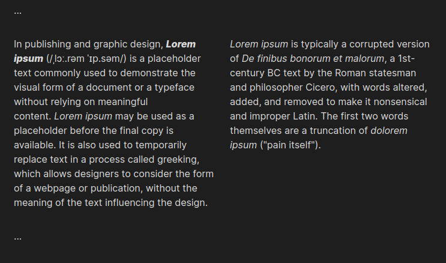
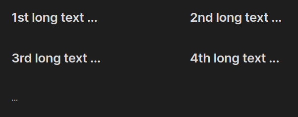
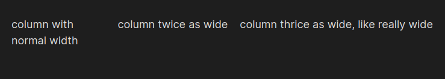

# Obsidian Simple Columns
Display your text side-by-side with a simple syntax.

This plugin provides a way to structure your notes into columns that can be displayed horizontally in both directions with custom width ratios in the Reading View.

## Installation
1. Download the zip or tar archive from [Releases](https://gitlab.com/sergeylavrent/obsidian-simple-columns/releases/latest) and extract it to `path/to/vault/.obsidian/plugins/`.
2. Restart Obsidian.
3. Enable it under **Settings > Community Plugins > Simple Columns**.

## Overview
```md
...

[begin]
In publishing and graphic design, _**Lorem ipsum**_ (/ˌlɔː.rəm ˈɪp.səm/) is a placeholder text commonly used to demonstrate the visual form of a document or a typeface without relying on meaningful content. _Lorem ipsum_ may be used as a placeholder before the final copy is available. It is also used to temporarily replace text in a process called greeking, which allows designers to consider the form of a webpage or publication, without the meaning of the text influencing the design.

[col]
_Lorem ipsum_ is typically a corrupted version of _De finibus bonorum et malorum_, a 1st-century BC text by the Roman statesman and philosopher Cicero, with words altered, added, and removed to make it nonsensical and improper Latin. The first two words themselves are a truncation of _dolorem ipsum_ ("pain itself").

[end]

...
```




- Between `[begin]` and `[end]` should be the text you want to be displayed in columns.
    - Everything before `[begin]` and after `[end]` is processed normally.
- A `[col]` between your paragraphs marks the end of a column and the start of a new one.
- You can write as many `[col]` tags as you like, as long as they are between `[begin]` and `[end]`.
- You can write as many `[begin]` and `[end]` blocks in your note, as long as you follow these syntax rules, otherwise the note won't be processed correctly.

## RTL arrangement
```md
[begin]
## First block

[col]
## Second block

[col]
## Third block

[end] rtl
```


By appending `rtl` to the `[end]` tag of your block, the columns will be put side-by-side in reversed order.

This is useful if your language is written right-to-left.

You can configure to have blocks processed like that by default by enabling the **RTL by default** setting. To process the blocks left-to-right, simply write `ltr` after the `[end]` tag. *Note: The setting will come into effect after switching into Reading View again.*

## Wrap columns
```md
[begin]
## 1st long text ...

[col]
## 2nd long text ...

[col]
## 3rd long text ...

[col]
## 4th long text ...

[col]
...

[end] wrap
```



By appending `wrap` to the `[end]` tag of your block, the columns won't be strictly displayed on one level and can wrap over to the next one if you have too many blocks. Their individual widths won't sink below 40%.

That way you don't have to write countless `[begin]`-`[end]`-pairs if you want to write your text in a kind of grid.

You can make this the default behavior by enabling the **Wrap blocks by default** setting. *Note: The setting will come into effect after switching into Reading View again.*

## Resize columns
```md
[begin]
column with normal width

[col] 2
column twice as wide

[col] 3
column thrice as wide, like really wide

[end]
```




By appending a number to a `[begin]` or `[col]` tag, you set the width ratio of your blocks. The three blocks in the example above will be processed with the width ratio of 1:2:3.

## Exclude mobile devices from rendering
You can prevent block rendering on mobile devices by disabling the **Render blocks on mobile** setting. That way, the `[begin]`, `[col]` and `[end]` tags will disappear from Reading View, but the text won't be shown side-by-side.

This is useful if you access a synced vault from the desktop on narrow screens.

# Coming soon (eventually)
- Apply columns in exported PDFs (right now they look like the normal document)
- delete unnecessary elements from the DOM (technical issue, no change in user experience)
